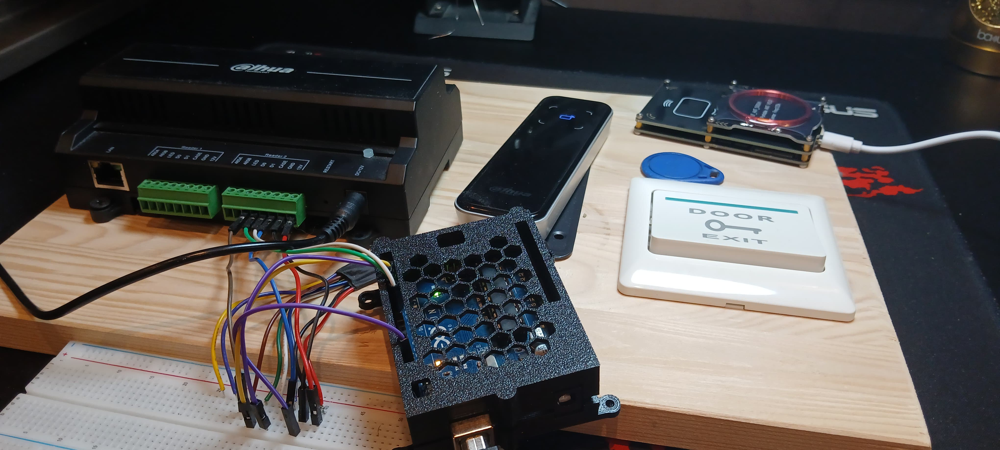
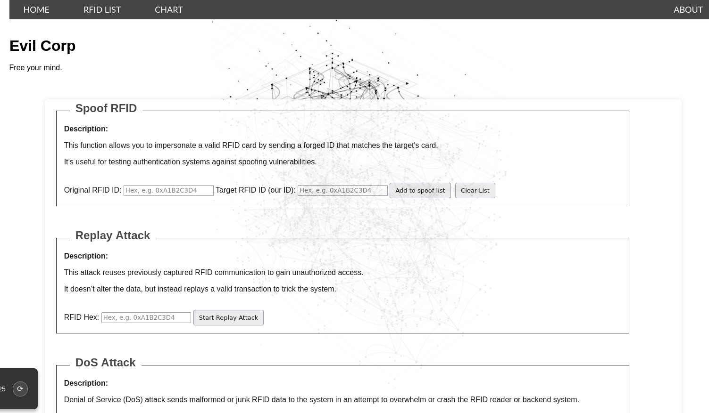
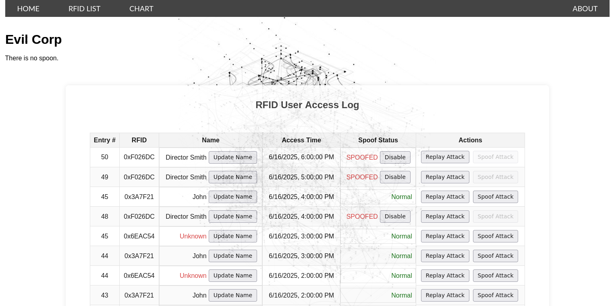
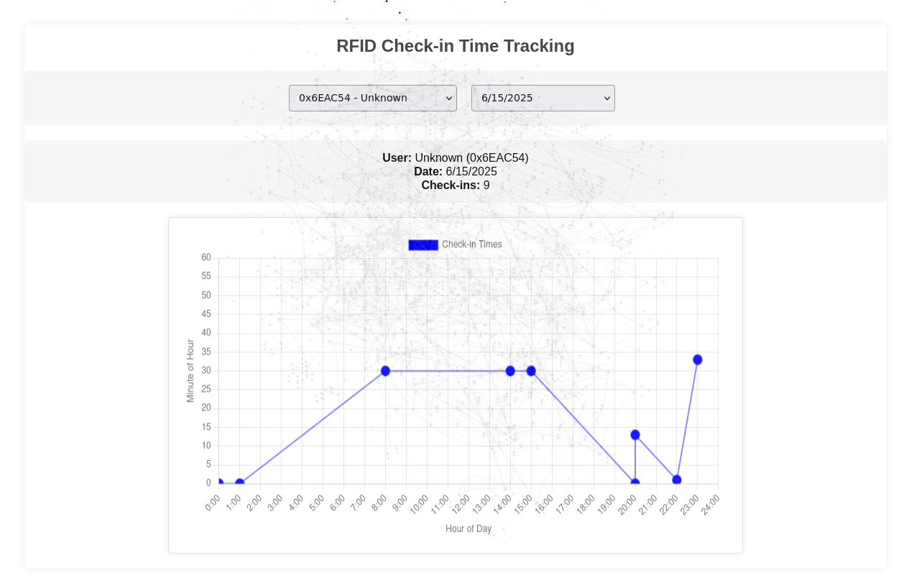
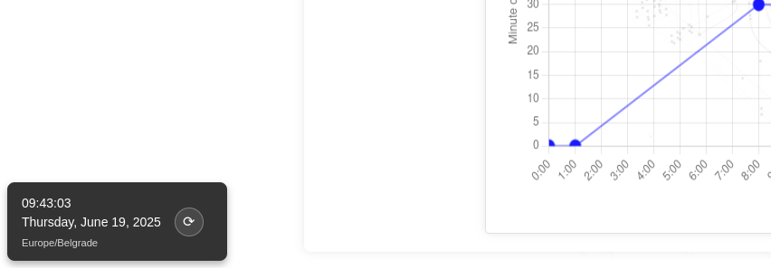
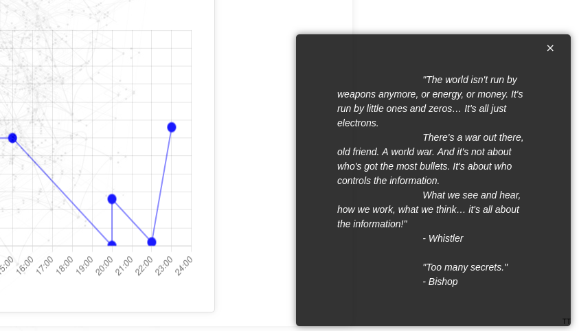

# ESP-07 Wiegand MITM Tool

A compact Wi-Fi-enabled man-in-the-middle (MITM) device for the Wiegand protocol, designed using an ESP-07 microcontroller. 
This tool supports sniffing, spoofing, replay, and DoS attacks against RFID readers and controllers using the Wiegand interface.


&nbsp;

> ⚠️ **DISCLAIMER:** This tool is for **educational and security testing purposes only**. Unauthorized use on devices you do not own may violate laws and ethical guidelines.

&nbsp;

---
## 🔧 How It Works

The ESP-07 Wiegand MITM device operates as a bridge between the RFID reader and the access control panel:
- Intercepts Wiegand data sent from the reader
- Logs and stores tag data with timestamps
- Allows manual spoofing and automated replay of RFID tags
- Launches DoS attacks by flooding the line with noise
- Hosts a web interface for real-time control and data visualization

Initially prototyped on an Arduino Uno for validation, the project moved to the ESP-07 for 3.3V logic compatibility and Wi-Fi support.



&nbsp;

---
## ## Dependencies

### 🧩 Hardware
- ESP-07 Wi-Fi Module (ESP8266)
- Wiegand-compatible RFID reader and controller
- ESP8266 programmer (e.g., ESP8266Burn debugger)

&nbsp;
### Software
- **Arduino IDE 2.x** – Required for flashing the ESP-07 firmware.
- **ESP8266 Board Package** – Required for compiling and uploading firmware to the ESP-07.
- **ArduinoJson Library** – Parses and structures commands sent to the ESP-07.
- **DNSServer** – Provides DNS server capabilities, often used in captive portals.
- **ESP8266WiFi** – Core library for handling Wi-Fi on ESP8266 boards.
- **ESPAsyncTCP** – Asynchronous TCP library, improves performance for TCP communication.
- **ESPAsyncWebServer** – Asynchronous HTTP server for serving web pages or APIs without blocking the main loop.
- **LittleFS** – Filesystem library for reading/writing files on the ESP8266's internal flash storage.
- **FS** – General filesystem interface, used as a base for specific file systems like LittleFS.
- **secrets.h** – Header file containing sensitive data such as Wi-Fi credentials (excluded from version control).


&nbsp;

---

## Web Interface

### Control Center (`index.html`)
The main dashboard provides complete operational control:

- **Spoofing Management**
  - Add manual spoof pairs (Original RFID → Target RFID)
  - Clear entire spoof list
- **Attack Modules**
  - Replay Attack: Send custom HEX tags
  - DoS Attack: Flood Wiegand lines with noise (0xFFFFFFFF)
- **System Status**
  - Real-time connection monitoring

&nbsp;



&nbsp;
### Access Log (`list.html`)
Comprehensive tracking and management interface:

- **RFID Event Logging**
  - Timestamped access attempts
  - Tag HEX values with customizable names
- **Tag Management**
  - Edit/rename stored tags
  - One-click replay for any recorded tag
  - Initiate spoof attacks from history
- **Data Control**
  - Clear entire access log
  - Persistent storage in `rfidusers.json`

&nbsp;



&nbsp;

### Analytics (`chart.html`)
Visual intelligence dashboard:

- **Access Heatmap**
  - Day/hour activity patterns
  - User frequency visualization
- **Behavior Analysis**
  - Common access times
  - Usage trends
 
&nbsp;



&nbsp;

## Time Synchronization
All interfaces include:
- Local time display
- "Sync Epoch" button to align device time with your current time zone
- Accurate timestamping for all logged events

&nbsp;



&nbsp;

## Easter Egg
*Shift + Left Click* on the TT logo reveals a hacker's homage to information warfare.

&nbsp;



&nbsp;

## Development Journey
- **Prototype Phase**: Arduino Uno validation (signal handling, spoofing verification)
- **Production Transition**: Migrated to ESP-07 for:
  - Native 3.3V logic compatibility
  - Wi-Fi enabled remote control

&nbsp;

## Getting Started
1. Flash ESP-07 with provided firmware
2. Connect to Wiegand lines (reader → MITM → controller)
3. Access web interface at `http://[device-ip]`

&nbsp;

---
# ESP-07 Firmware Installation Guide

This guide provides step-by-step instructions for setting up the Arduino IDE, installing dependencies, and flashing the ESP-07 module.

&nbsp;
## 1. Setting Up Arduino IDE 2.x

### Install the ESP8266 Board Package
1. Open **Arduino IDE 2.x**.
2. Navigate to **File > Preferences**.
3. Add the following URL under **Additional Board Manager URLs**: `http://arduino.esp8266.com/stable/package_esp8266com_index.json`
4. Go to **Tools > Board > Board Manager**, search for `ESP8266`, and install it.

&nbsp;
### Install Required Libraries
Open the **Library Manager** (**Tools > Library Manager**) and install:

- **ArduinoJson** *(Benoit Blanchon)*  
Used for parsing and creating structured JSON data.

- **DNSServer** *(Part of ESP8266 core)*  
Included automatically; no separate installation needed.

- **ESP8266WiFi** *(Part of ESP8266 core)*  
Handles Wi-Fi operations (AP/STA modes).

&nbsp;
### Install Asynchronous Networking Libraries (Manual Installation)
These libraries must be installed manually:

&nbsp;
#### **ESPAsyncTCP**
1. Download from GitHub:  
[https://github.com/me-no-dev/ESPAsyncTCP](https://github.com/me-no-dev/ESPAsyncTCP)
2. Extract and place the folder in your Arduino `libraries` directory:
- **Windows**: `Documents\Arduino\libraries\ESPAsyncTCP`
- **Linux/macOS**: `~/Arduino/libraries/ESPAsyncTCP`

&nbsp;
#### **ESPAsyncWebServer**
1. Download from GitHub:  
[https://github.com/me-no-dev/ESPAsyncWebServer](https://github.com/me-no-dev/ESPAsyncWebServer)
2. Place the extracted folder in the same `libraries` directory.

⚠️ **Note**: `ESPAsyncWebServer` requires both `ESPAsyncTCP` and `ESP8266WiFi`.

&nbsp;
### Restart Arduino IDE
After installation, restart the IDE to apply changes.

&nbsp;

## 2. Flashing the ESP-07

### Uploading the Sketch
1. Open `espRFID.ino` in Arduino IDE.
2. Place the `data` folder (containing HTML/scripts) in the same directory as the sketch.
3. Connect the ESP-07 via an **ESP8266Burn debugger**.
4. Select the correct **ESP8266 board** and **COM port** in the IDE.
5. Upload the sketch.

&nbsp;
### Uploading Files to LittleFS
To upload the `data` folder to the ESP-07's filesystem:

&nbsp;
#### Install the LittleFS Uploader Plugin
1. Download the plugin `.vsix` file from:  [Releases Page](https://github.com/earlephilhower/arduino-littlefs-upload/releases/download/1.5.3/arduino-littlefs-upload-1.5.3.vsix)
2. Place the file in:
- **Windows**: `C:\Users\<username>\.arduinoIDE\plugins\`
- **Linux/macOS**: `~/.arduinoIDE/plugins/` (create the folder if missing).
3. Restart Arduino IDE.
4. Verify installation by pressing **Ctrl + Shift + P** and searching for:   **`Upload Little FS to Pico/ESP8266/ESP32`**.

&nbsp;
#### Upload Files
- Use the command above to upload the `data` folder contents to LittleFS.

&nbsp;

---
## Configuration via `secrets.h`

The `secrets.h` file contains sensitive and customizable parameters for the ESP-07. **You must modify this file** before flashing the firmware to match your environment. Below are the key configurations:

&nbsp;
### 1. **Wi-Fi Credentials**
The ESP-07 operates in **dual mode**:
- **STA (Station) Mode**: Connects to your local Wi-Fi network for debugging/internal communication.
- **AP (Access Point) Mode**: Creates a fallback Wi-Fi network if STA mode fails (e.g., no Wi-Fi available).

&nbsp;

#### **Local Wi-Fi (STA Mode)**
- Replace these with your home/office network credentials:
```cpp
#define LOCAL_SSID "MyWiFiNetwork"    // Your Wi-Fi SSID
#define LOCAL_PASS "password1234"     // Your Wi-Fi password
```
- If connection fails, the ESP-07 switches to AP mode automatically.


&nbsp;

#### **Access Point (AP Mode)**
Predefined fallback network (change if needed):
```cpp
#define AP_SSID "ESP-07-Access-Point"  // Default AP SSID
#define AP_PASS "123456789"             // Default AP password
```
Devices can connect to this network to access the ESP-07’s web interface at `http://192.168.1.1`.


&nbsp;

## Security Notes

- 🔒 Change the default `AP_SSID` and `AP_PASS` in production.
- 📶 If STA mode fails, the ESP-07 remains accessible via AP mode for configuration.
    

&nbsp;

---
## Final Thoughts

This started as a weekend experiment with an Arduino and grew into something unexpectedly useful. The ESP-07 turned out to be a perfect fit – its 3.3V logic plays nice with Wiegand systems, and Wi-Fi control makes testing way easier.

&nbsp;

**What I like most:**
- Spoofing/replay works surprisingly well on older installations
- The heatmap actually helped me spot shift patterns at my lab’s door
- **How satisfying it is to see your own spoofed tag** unlock a door (with permission, of course!)

&nbsp;

---
### ⚠️ Just a Friendly Warning

I built this to learn about RFID systems – **not to break into places**. Messing with security systems without permission will:
1. Probably get you fired
2. Maybe get you arrested
3. Definitely void warranties
    
Use responsibly!

&nbsp;

---
## License
- This project is licensed under the MIT License. See the [LICENSE](https://github.com/Im0nk3yar0und/wiegand-mitm/blob/main/LICENSE) file for details.

&nbsp;

---
## ⚠️ Disclaimer

**This project is intended for:**
- Security research and penetration testing **with explicit permission**
-  Educational purposes in controlled environments
- Responsible disclosure of vulnerabilities

&nbsp;

**Legal Notice:**
- Unauthorized use on systems you don't own or have permission to test is illegal
- RFID spoofing may violate laws in your jurisdiction (e.g., CFAA, Computer Misuse Act)
- The creator assumes no liability for misuse of this tool

&nbsp;

**Ethical Considerations:**
- Always obtain written authorization before testing any system
- Document findings responsibly for vulnerability reporting
- Never use this tool to bypass security of operational systems
